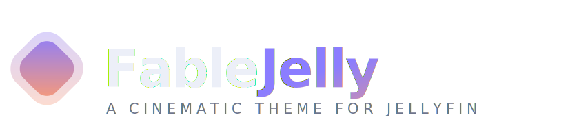
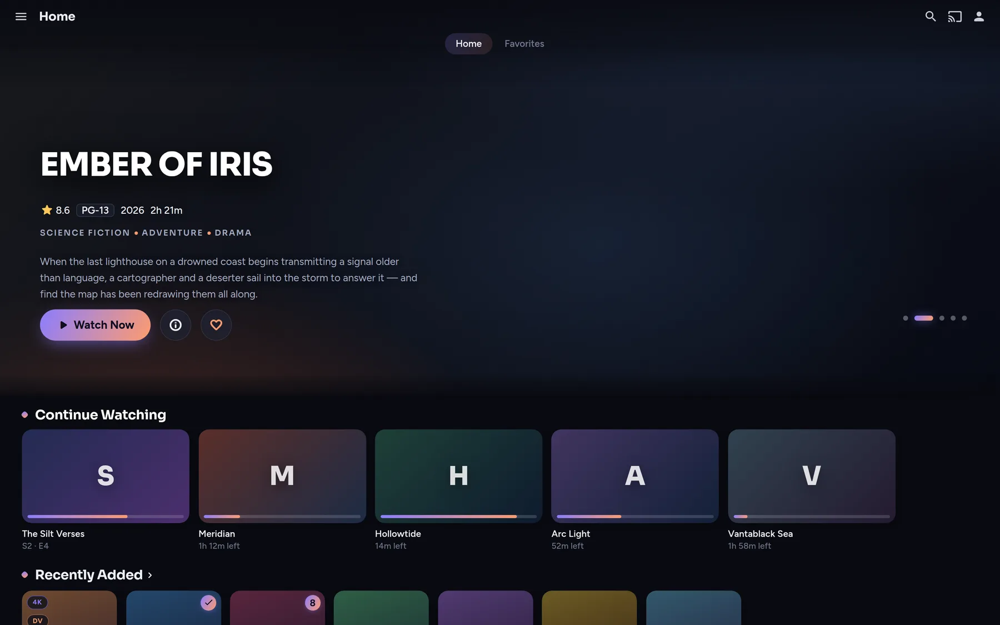
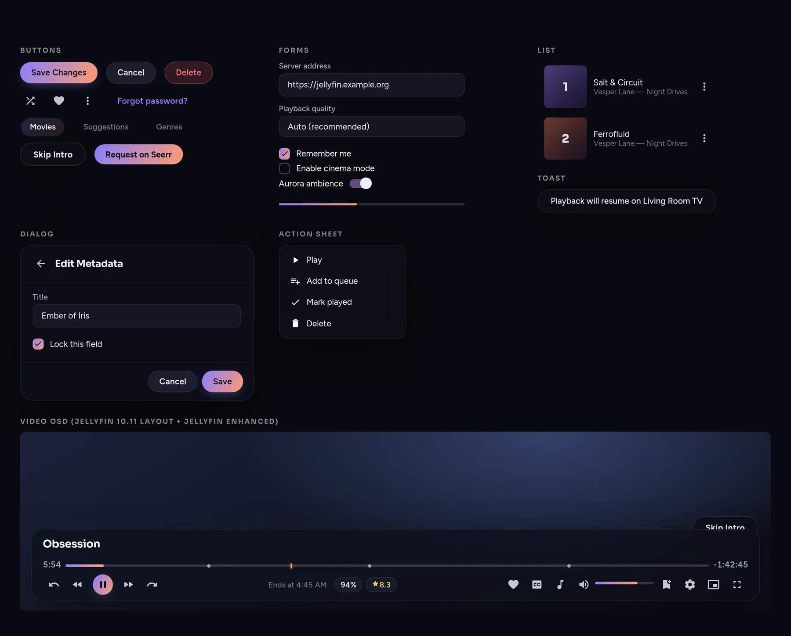
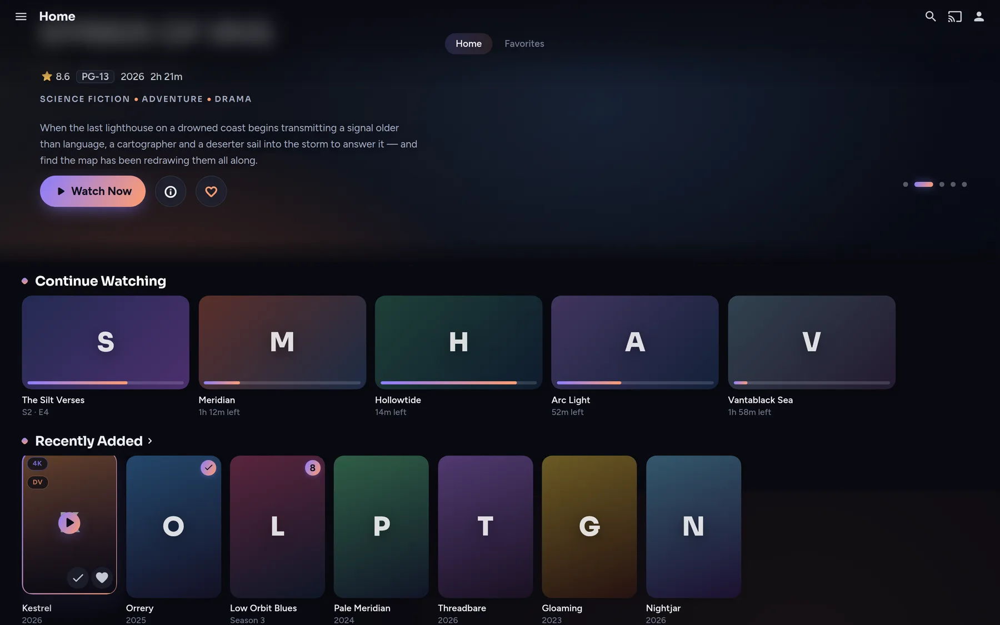
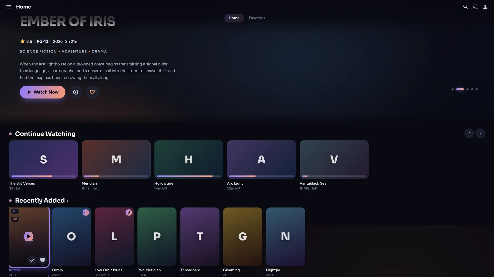
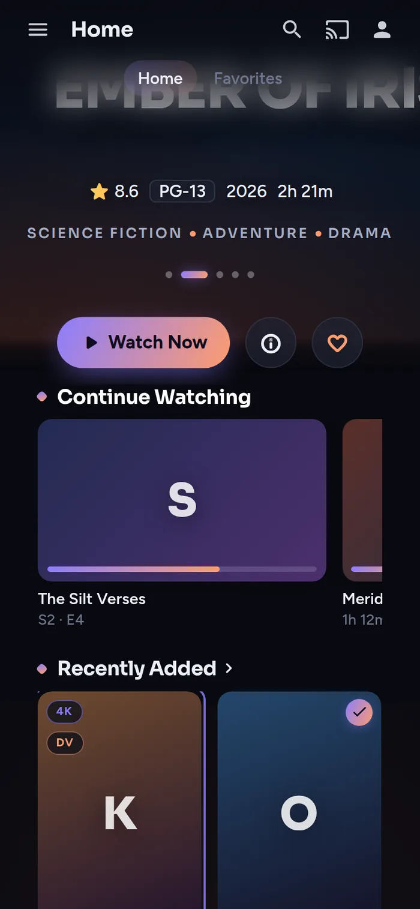

<div align="center">



### A cinematic, fully-customisable theme for Jellyfin

Deep-ink canvas · aurora ambience · gradient signature · glass chrome
Typography-led design that doesn't look like any other Jellyfin theme.

[Install](#install) · [Presets](#presets) · [Addons](#addons) · [Customize](docs/CUSTOMIZATION.md) · [Plugins](docs/PLUGINS.md)



<sup>*Previews are styled design mockups of the Jellyfin UI (placeholder artwork) — your server shows your posters.*</sup>

</div>

---

## What makes it different

Most Jellyfin themes recolour the stock UI. FableJelly redraws its voice:

- **Typography-led** — *Sora* for display, *Figtree* for UI. Section headings carry a rotated gradient tick; titles are set tight and heavy. No other theme touches type like this.
- **The gradient signature** — one iris→ember gradient runs through everything: play buttons, progress bars, focus rings, switches, slide dots, indicators. Change two variables and the whole theme follows.
- **Aurora ambience** — two colour fields drift very slowly behind the canvas. Almost free to render, and it makes the UI feel alive without shouting.
- **Progressive glass** — the header is a blur that *dissolves* downwards instead of ending at an edge; drawers, dialogs and the player OSD are floating glass islands.
- **Cards with intent** — resting cards are quiet; on hover they lift, the art zooms, and a gradient ring ignites around the frame. On TV the focus ring is unmistakable.
- **Plugin auto-fit** — plugins that reuse Jellyfin's primitives inherit the theme automatically, and the big ones (Media Bar, Jellyfin Enhanced, Intro Skipper) get bespoke treatment. [Details →](docs/PLUGINS.md)
- **Every device** — desktop, mobile (touch-aware: press feedback instead of hover), TV (no heavy blur, loud focus states), ultrawide, reduced-motion and high-contrast preferences.

## Install

Jellyfin **Dashboard → General → Custom CSS**, paste, save, hard-refresh (`Ctrl`+`Shift`+`R`):

```css
@import url("https://cdn.jsdelivr.net/gh/Nenormaln1/FableJelly@latest/fablejelly.css");
```

Set the server theme to **Dark** (Dashboard → General → Appearance) for best results.

> [!TIP]
> Users can also apply it per-account under **Settings → Display → Custom CSS** — handy for trying it before rolling it out server-wide.

## Presets

A preset is just a block of design tokens — import one *after* the core line:

```css
@import url("https://cdn.jsdelivr.net/gh/Nenormaln1/FableJelly@latest/fablejelly.css");
@import url("https://cdn.jsdelivr.net/gh/Nenormaln1/FableJelly@latest/presets/ember.css");
```

| Preset | Mood | Canvas | Accents |
| --- | --- | --- | --- |
| **Nebula** *(built-in)* | The signature | Deep ink | Iris `#8b7dff` → Ember peach `#ff9c6e` |
| [`ember`](presets/ember.css) | Late-night cinema | Warm charcoal | Crimson `#ff6063` → Amber `#ffb74d` |
| [`ocean`](presets/ocean.css) | Abyssal calm | Blue-black | Azure `#56a4ff` → Mint `#54e6bc` |
| [`orchid`](presets/orchid.css) | The loud one | Plum-black | Fuchsia `#ec64c4` → Violet `#9e74ff` |
| [`verdant`](presets/verdant.css) | Overgrown | Moss-black | Emerald `#4ade80` → Lime `#bef264` |
| [`monolith`](presets/monolith.css) | Monochrome | Near-black | Bone `#ebecf0` → Grey `#9ea2ac` |
| [`oled`](presets/oled.css) | True black | `#000000` | Nebula accents |
| [`daybreak`](presets/daybreak.css) | Light mode | Porcelain | Deep iris `#6854ff` → Coral `#f06e44` |

## Addons

Stack as many as you like, in any order, after the core/preset imports:

| Addon | Effect |
| --- | --- |
| [`grain`](addons/grain.css) | 35mm film grain + vignette (auto-hides during playback) |
| [`square`](addons/square.css) | Sharp editorial corners everywhere |
| [`compact`](addons/compact.css) | Denser chrome for big libraries |
| [`motion-off`](addons/motion-off.css) | Freezes all animation (weak devices / taste) |
| [`ambience-off`](addons/ambience-off.css) | Flat canvas — no aurora, no grain |

## Fonts

FableJelly ships with **Sora** (display) + **Figtree** (UI), backed by **Onest** so Cyrillic, Greek-adjacent and extended-Latin libraries render in the theme's voice instead of a system fallback.

Not fixed — swap the whole UI's typography with one import after the core:

```css
@import url("https://cdn.jsdelivr.net/gh/Nenormaln1/FableJelly@latest/fonts/inter.css");
```

| Pack | Voice | Script coverage |
| --- | --- | --- |
| *(default)* Sora + Figtree | The FableJelly signature | Latin (+Cyrillic via Onest fallback) |
| [`onest`](fonts/onest.css) | One consistent geometric everywhere | Latin, Latin-ext, **Cyrillic** |
| [`inter`](fonts/inter.css) | The neutral professional | Latin, **Cyrillic**, Greek, Vietnamese |
| [`manrope`](fonts/manrope.css) | Soft, rounded modern | Latin, **Cyrillic**, Greek |
| [`outfit`](fonts/outfit.css) | Pure geometric, "streaming service" | Latin (+Cyrillic fallback) |
| [`space-grotesk`](fonts/space-grotesk.css) | Technical headings, Inter body | Latin display, **Cyrillic** body |
| [`system`](fonts/system.css) | Your OS's native font, zero downloads | Everything, instantly |

Or point `--fj-font-display` / `--fj-font-body` at any font you like — see the guide below.

## Customize

Everything is a CSS variable. Override any token *after* the imports — no forking needed:

```css
@import url("https://cdn.jsdelivr.net/gh/Nenormaln1/FableJelly@latest/fablejelly.css");

:root {
    --fj-accent: 0, 200, 255;      /* your colour, as R, G, B   */
    --fj-accent-2: 255, 0, 128;    /* gradient partner          */
    --fj-radius: 20px;             /* rounder cards             */
    --fj-aurora-opacity: 0.8;      /* more ambience             */
    --fj-font-display: "Clash Display", sans-serif;
}
```

The full token reference (60+ variables: colours, glass, shape, type, motion, ambience, cards) plus ready-made recipes lives in **[docs/CUSTOMIZATION.md](docs/CUSTOMIZATION.md)**.

## Plugin support

| Plugin | Level |
| --- | --- |
| [Media Bar](https://github.com/MakD/Jellyfin-Media-Bar) (MakD + [plugin 2.x](https://github.com/IAmParadox27/jellyfin-plugin-media-bar)) | **Bespoke** — gradient play pill, glass chips, elongating slide dots, themed loader |
| [Jellyfin Enhanced](https://github.com/n00bcodr/Jellyfin-Enhanced) | **Bespoke** — quality tags, OSD rating chips, bookmarks, pause screen, Seerr buttons/cards |
| [Intro Skipper](https://github.com/intro-skipper/intro-skipper) / Media Segments | **Bespoke** — skip buttons become glass pills, gradient on hover |
| [Custom Tabs](https://github.com/IAmParadox27/jellyfin-plugin-custom-tabs) | **Automatic** — tab strip themed; author content with Jellyfin primitives and it's native |
| Home Screen Sections, Trickplay, Jellyscrub, Skin Manager… | **Automatic** — they reuse Jellyfin primitives, so they inherit the theme |
| AudioDB, MusicBrainz, OMDb, TMDb, Open Subtitles, Studio Images… | **N/A** — server-side only; their settings pages inherit automatically |

How the auto-fit works — and how to request deeper support for a plugin — is in **[docs/PLUGINS.md](docs/PLUGINS.md)**.

## Device support

| Surface | Treatment |
| --- | --- |
| Desktop | Full experience: hover choreography, glass, ambience |
| Mobile / tablet | Touch-aware press feedback, tightened radii, thumb-sized targets, swipe-first scrollers |
| TV (`layout-tv`) | Blur-free surfaces for weak GPUs, loud gradient focus rings, bigger type, pointer chrome hidden |
| Accessibility | Honours `prefers-reduced-motion` and `prefers-contrast: more` out of the box |

<details>
<summary><b>More previews</b> — components, hover, mobile, TV focus</summary>
<br>

**Every control, one voice** — buttons, forms, dialogs, action sheet, toast, video OSD:



**Card hover** — lift, art zoom, gradient ring (note the header's progressive blur over the hero):



**TV focus ring** and **mobile layout**:

 

</details>

## Version pinning

`@latest` tracks the newest commit (jsDelivr caches ~12h). To pin, use a commit hash:

```css
@import url("https://cdn.jsdelivr.net/gh/Nenormaln1/FableJelly@<commit-sha>/fablejelly.css");
```

## FAQ

**Fonts/icons don't load?** They come from Google Fonts and jsDelivr — clients need internet access. Everything degrades gracefully to system fonts and stock Material Icons.

**Using Jellyfin Enhanced's theme selector?** Keep it set to **Default** — FableJelly lives in Custom CSS, and stacking a second theme on top will produce mixed styling.

**Dashboard looks half-themed on 10.11?** The new React admin dashboard uses generated class names that custom CSS can't reliably target. User-facing surfaces are unaffected.

**Media Bar + Daybreak (light)?** The bar composites artwork against the canvas — it looks best on the dark presets.

**Something's broken after a Jellyfin update?** Open an issue with your Jellyfin version and a screenshot — selectors are kept current for 10.9–10.11.

## Credits

Built from scratch, with respect for the ideas explored by [Abyss](https://github.com/AumGupta/abyss-jellyfin), [Zombie](https://github.com/MakD/zombie-release) and the wider Jellyfin theming community.

**License:** [MIT](LICENSE)
